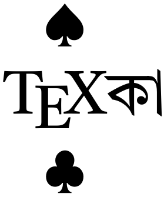
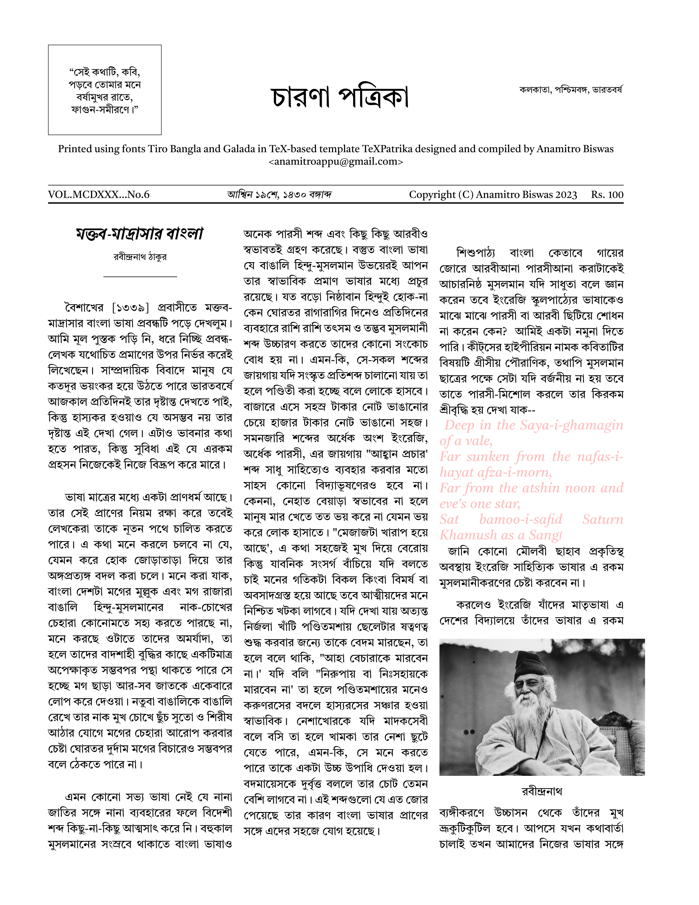

# TeXPatrika
A TeX template and application compatible with Bengali language-script and the traditional patrika style of printing.

|  |
| --- |
| means ‘ace’ in playing cards, and is derived from TeX(patri)ka. It is a template designed for newspaper and literary magazine, adapting the traditional styles of enigmatic journals of the era of Kazi Nazrul’s Dhumketu into a new digital era of color printing and PDF readers. Runs on XeTeX and ideally uses fonts Alkatra for headings, Tiro Bangla for Bengali and Latin Texts. |

This template is part of the project [**TeXচাঁদ**](https://anamitro.github.io/TeXchand). Email anamitroappu@gmail.com for sugestions, feedback or queries.

|  | |
| --- | --- |
| | **An example** |
| | **.tex file** |
| | **TeXচাঁদ** |
| |**Anamitro's homepage** |

___

Copyright (C) 2024 Anamitro Biswas
